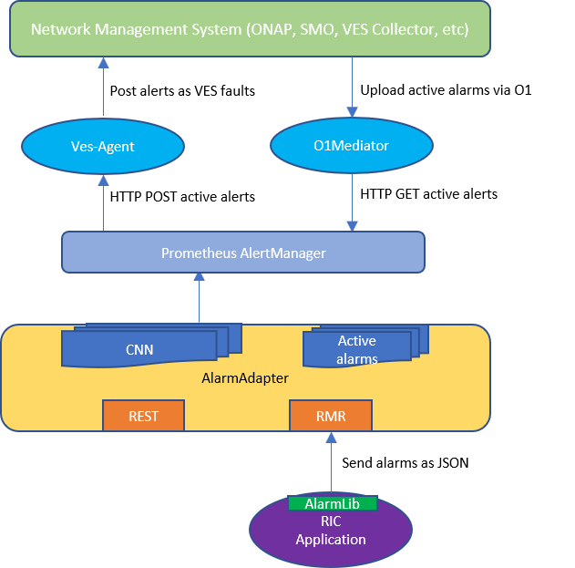

RIC Alarm Adapter and Library Interface
=======================================

This repository containts Golang implementation of Alarm Adapter and related application library interface.

Architecture
------------



The **Alarm Library** provides a simple interface for RIC applications (both platform application and xApps) to raise, clear and re-raise. The **Alarm Library** interacts with the **Alarm Adapter** via RMR interface.

The **Alarm Adapter** is reponsible for managing alarm situations in RIC cluster and interfacing with **Northboubd** applications such as **Prometheus AlertManager** to pass the alarms.

Overview for Alarm Adapter
--------------------------

### TBD

Overview for Alarm Library
--------------------------

## Initialization

A new alarm instance is created with InitAlarm function. MO and application identities are given as a parameter.

## Alarm Context and Format

The Alarm object contains following parameters:
 * *SpecificProblem*: problem that is the cause of the alarm
 * *PerceivedSeverity*: The severity of the alarm, see above for possible values
 * *ManagedObjectId*: The name of the managed object that is the cause of the fault
 * *ApplicationId*: The name of the process raised the alarm
 * *AdditionalInfo*: Additional information given by the application
 * *IdentifyingInfo*: Identifying additional information, which is part of alarm identity

## Alarm APIs
* *Raise*: Raises the alarm instance given as a parameter
* *Clear*: Clears the alarm instance given as a parameter, if it the alarm active
* *Reraise*: Attempts to re-raise the alarm instance given as a parameter
* *ClearAll*: Clears all alarms matching moId and appId given as parameters

## Example
-------

```go
package main

import (
	alarm "gerrit.o-ran-sc.org/r/ric-plt/alarm-go/alarm"
)

func main() {
	alarmer, err := alarm.InitAlarm("ric", "dummy-xapp")

	a := Alarm{
		SpecificProblem: 1234,
		PerceivedSeverity: SeverityMajor,
		AdditionalInfo:  "Some application specific data",
		IdentifyingInfo: "eth 0 1",
	}

	// Raise an alarm (SP=1234, etc)
	err = alarmer.Raise(a)

	// Clear an alarm (SP=1234)
	err = alarmer.Clear(a)

	// Re-raise an alarm (SP=1234)
	err = alarmer.Reraise(a)
}
```

CI
--

The Dockerfile in the `ci` directory _only_ runs, when build, the library unit tests for the repository.

License
-------
 Copyright (c) 2019 AT&T Intellectual Property.
 Copyright (c) 2018-2019 Nokia.

 Licensed under the Apache License, Version 2.0 (the "License");
 you may not use this file except in compliance with the License.
 You may obtain a copy of the License at

     http://www.apache.org/licenses/LICENSE-2.0

 Unless required by applicable law or agreed to in writing, software
 distributed under the License is distributed on an "AS IS" BASIS,
 WITHOUT WARRANTIES OR CONDITIONS OF ANY KIND, either express or implied.
 See the License for the specific language governing permissions and
 limitations under the License.

 This source code is part of the near-RT RIC (RAN Intelligent Controller)
 platform project (RICP).


